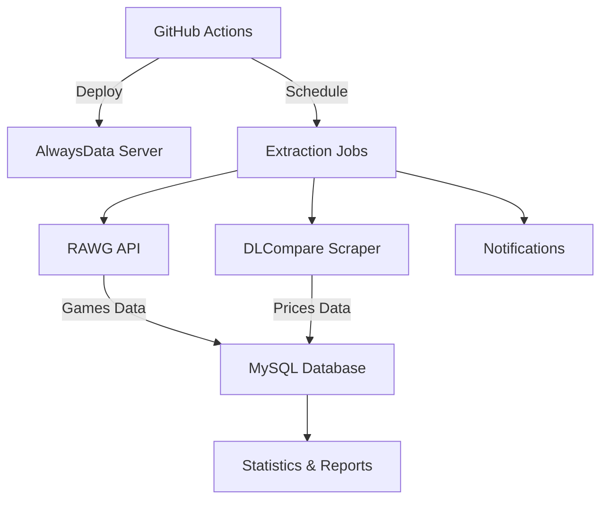

# 🎮 Game Data Extractor

[](https://github.com/Anne68/game-data-extractor/actions/workflows/deploy.yml)
[](https://github.com/Anne68/game-data-extractor/actions/workflows/scheduled-extraction.yml)

> 🤖 Système d'extraction automatique de données de jeux vidéo avec déploiement sur AlwaysData via GitHub Actions

## ✨ Fonctionnalités

- 🎯 **Extraction automatique** depuis l'API RAWG.io
- 💰 **Scraping des prix** depuis DLCompare  
- 🗄️ **Stockage MySQL** sur AlwaysData
- ⏰ **Planification automatique** via GitHub Actions
- 📊 **Monitoring complet** avec logs et notifications

## 🚀 Démarrage Rapide

### 1. Configurez les secrets GitHub
Dans **Settings > Secrets and variables > Actions** :

```
ALWAYSDATA_HOST=ssh-anne.alwaysdata.net
ALWAYSDATA_USERNAME=anne
ALWAYSDATA_SSH_KEY=votre-cle-ssh-privee
DB_HOST=mysql-anne.alwaysdata.net
DB_USER=anne
DB_PASSWORD=Vicky2@18
DB_NAME=anne-games-db
RAWG_API_KEY=a596903618f14aeeb1fcbbb790180dd5
```

### 2. Push vers main
Le déploiement se fait automatiquement ! 🎉

## 📊 Architecture



## ⏰ Automatisation

### Planification par Défaut
- **06:00 & 18:00** : Extraction de 500 nouveaux jeux
- **12:00** : Scraping de prix
- **02:00 dimanche** : Maintenance

### Déclencheurs Manuels
Via GitHub Actions Interface :
`Actions > Scheduled Data Extraction > Run workflow`

## 🛠️ Structure du Projet

```
game-data-extractor/
├── 📁 .github/workflows/     # GitHub Actions (CI/CD)
├── 📁 src/                   # Code source principal
│   ├── 📁 extractor/         # Modules d'extraction
│   ├── 📁 automation/        # Planification et notifications  
│   └── 📁 utils/             # Utilitaires (config, logging)
├── 📁 scripts/               # Scripts d'exécution
├── 📁 config/                # Configuration JSON
├── 📁 tests/                 # Tests unitaires et intégration
└── 📁 docs/                  # Documentation
```

## 📊 Monitoring

### Logs
```bash
# Voir les logs en direct
tail -f ~/game-extraction/logs/extraction.log

# Statistiques rapides
python3 scripts/run_extraction.py --status
```

## 🤝 Contribution

1. **Fork** le projet
2. **Créer une branche** pour votre fonctionnalité
3. **Commiter** vos changements
4. **Tester** avec `pytest`
5. **Soumettre une Pull Request**

## 📄 License

Ce projet est sous licence **MIT**.

---

*Développé avec ❤️ pour la communauté des développeurs et gamers*
